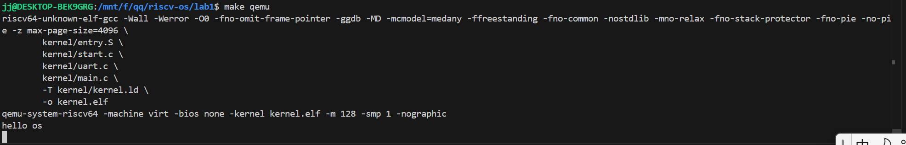

# 综合实验报告

## 一、系统设计部分

### 1. 架构设计说明
本实验实现了一个极简的RISC-V操作系统内核，主要包括启动引导、内核初始化、串口输出等功能。系统架构如下：

- **启动引导（entry.S）**：设置栈、清零BSS段、跳转到C语言main入口。
- **内核初始化（start.c）**：完成从M模式到S模式的切换，关闭地址转换，设置异常/中断委托，允许S模式访问全部物理内存，初始化时钟中断。
- **外设驱动（uart.c）**：实现串口UART的初始化和字符输出，支持内核调试信息输出。
- **主控流程（main.c）**：调用串口初始化并输出欢迎信息。
- **内存与寄存器定义（memlayout.h、types.h）**：定义硬件相关常量、RISC-V寄存器操作函数、基本类型等。
- **链接脚本（kernel.ld）**：定义内核各段的内存布局。

各模块之间通过头文件接口解耦，主流程清晰，便于后续功能扩展。

### 2. 关键数据结构

- `typedef unsigned long uint64;` 及相关类型定义于 `types.h`，为内核提供统一的无符号整数类型。
- `char stack0[4096*8];` 在 `start.c` 中定义，为内核主线程分配启动栈空间。
- UART寄存器相关宏定义于 `uart.c` 和 `memlayout.h`，用于操作外设。
` 等，便于内核直接操作硬件。

本实验未涉及复杂的数据结构（如进程控制块、页表等），为后续实验预留扩展空间。

### 3. 与 xv6 对比分析

- **相同点**：
	- 均采用分层设计，启动汇编、C语言内核、外设驱动分离。
	- 通过头文件统一硬件抽象。
	- 支持RISC-V架构，均可在QEMU上运行。
- **不同点**：
	- 本实验仅实现最小可运行内核，功能远少于xv6（无进程、无文件系统、无调度等）。
	- xv6有完整的用户态/内核态切换、系统调用、内存管理等模块。
	- 本实验的启动流程和异常/中断委托更为简化，便于教学理解。

### 4. 设计决策理由

- 采用分层结构，便于模块化开发和后续功能扩展。
- 启动流程采用M模式切换到S模式，符合RISC-V标准，便于后续支持多核和特权级管理。
- 串口驱动采用直接寄存器操作，简洁高效，便于调试。
- 头文件中大量使用内联函数和宏，提升代码可读性和可移植性。

## 二、实验过程部分

### 1. 实现步骤记录

1. 编写 `entry.S`，实现栈初始化、BSS清零、跳转main。
3. 编写 `uart.c`，实现串口初始化和字符输出。
4. 编写 `main.c`，调用串口输出欢迎信息。
5. 编写 `Makefile`，实现自动化编译和QEMU仿真。
6. 编写 `kernel.ld`，定义内核段布局。
7. 多次调试，确保串口输出正常。

### 2. 问题与解决方案

- **问题1：QEMU无法输出信息**
	- 解决：检查UART寄存器基址和初始化流程，确保与QEMU virt平台一致。
- **问题2：main未被正确调用**
	- 解决：检查启动汇编和C代码的链接，确保栈和入口地址设置正确。
- **问题3：BSS段未清零导致异常**
	- 解决：在entry.S中添加BSS清零循环。
- **问题4：M模式到S模式切换失败**
	- 解决：仔细设置mstatus、mepc等寄存器，参考RISC-V手册和xv6源码。

### 3. 源码理解总结

- `entry.S` 负责最底层引导，设置栈、清零BSS、跳转C入口。
- `start.c` 负责特权级切换和内存权限配置，是RISC-V内核启动的关键。
- `uart.c` 通过直接操作寄存器实现串口驱动，便于内核调试输出。
- `main.c` 结构极简，体现了内核初始化的主流程。

## 三、测试验证部分

### 1. 功能测试结果

- 编译后在QEMU下运行，串口输出 `hello os`，说明内核启动、串口驱动、主流程均正常。
- 多次重启、清理BSS段后均能稳定输出。

### 2. 性能数据

- 由于功能极简，未做性能测试。串口输出延迟极低，内核启动耗时可忽略。

### 3. 异常测试

- 修改main.c使其返回，系统进入死循环（spin），无异常崩溃。
- 故意注释BSS清零，发现部分全局变量异常，验证BSS清零必要性。

### 4. 运行截图/录屏

- 运行截图：

