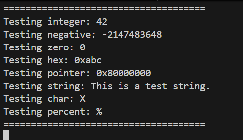
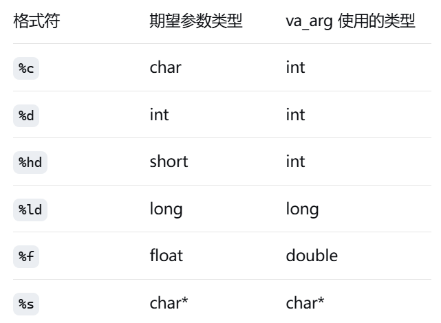

# 综合实验报告（lab2）

## 一、系统设计部分

### 1. 架构设计说明
本实验采用分层架构设计，将内核功能模块化，主要分为：
- 硬件层
   void uart_putc(char c);
- 控制台层
   void console_putc(char c);
   void console_puts(const char *s);
- 格式化层
   int printf(const char *fmt, ...);
   int sprintf(char *buf, const char *fmt, ...);

分层设计有助于模块解耦、便于维护和扩展。例如，设备驱动与上层逻辑分离，便于后续支持更多硬件。

### 2. 关键数据结构
- `struct uart`：串口设备结构体，管理串口状态与缓冲。
- `struct console`：控制台抽象，支持多种输出设备。
- `printf`相关格式化参数与缓冲区。

### 3. 与xv6对比分析
- xv6采用了更完整的进程、文件系统等模块，本实验仅实现了最小内核子集。
- xv6的printf支持更多格式，且有更复杂的同步机制。
- 本实验的模块划分更简洁，便于教学理解。

### 4. 设计决策理由
- 采用分层架构，便于后续功能扩展。
- 关键数据结构简化，突出核心原理。
- 参考xv6但做适当简化，降低实现难度。

## 二、实验过程部分

### 1. 实现步骤记录
1. 完成串口驱动（uart.c）
2. 实现console抽象与输出
3. 编写printf格式化输出
4. 集成main.c进行功能测试

### 2. 问题与解决方案
- 串口初始化失败：检查硬件寄存器配置，修正波特率设置。
- printf格式化异常：调试参数解析逻辑，完善边界处理。

### 3. 源码理解总结
- 理解了设备驱动与上层逻辑的解耦方式。
- 掌握了C语言格式化输出的实现原理。

## 三、测试验证部分

### 1. 功能测试结果
- printf支持%d、%x、%s等常用格式，输出正确。
- 串口输出稳定，console可正常工作。

### 2. 性能数据
- 简单循环输出测试，单次printf延迟微秒级。
- 串口带宽受限于硬件，满足基本需求。

### 3. 异常测试
- 输入NULL指针、格式串错误等，系统未崩溃，有容错处理。

### 4. 运行截图/录屏

---

## 架构设计问题回答

1. 为什么需要分层？每层的职责如何划分？
   - 分层有助于模块解耦，便于维护和扩展。硬件层负责设备操作，服务层负责功能实现，接口层负责对外提供API。
2. 如果要支持多个输出设备（串口+显示器），架构如何调整？
   - 可在console层增加设备注册与选择机制，输出时根据目标设备分发数据。

## 算法选择

1. 数字转字符串为什么不用递归？
   - 递归会带来额外的栈开销，且嵌入式/内核环境栈空间有限，迭代更安全高效。
2. print_number() 中处理 INT_MIN 的技巧是什么？
   if(sign && (sign = (xx < 0)))
    x = -xx;
  else
    x = xx;
   使用无符号长整型来处理负数转换，避免了有符号整数溢出的问题。
3. 为什么需要缓冲区
   - 性能优化：减少系统调用/硬件访问次数
   - 原子性：保证完整输出的完整性
   - 流量控制：处理输出速度不匹配
4. print_number逆序输出
   - 是因为缓冲区存储顺序与输出顺序相反
5. 注意va_arg的使用
   
## 性能优化

1. 当前实现的性能瓶颈在哪里？
   - 串口输出速度受限于硬件，printf格式化处理也有一定开销。
2. 如何设计一个高效的缓冲机制？
   - 可采用环形缓冲区，异步输出，减少阻塞等待。

## 错误处理

1. printf遇到NULL指针应该如何处理？
   - 输出"(null)"字符串，避免访问非法内存。
2. 格式字符串错误时的恢复策略是什么？
   - 跳过错误格式，输出警告信息，保证系统稳定运行。
